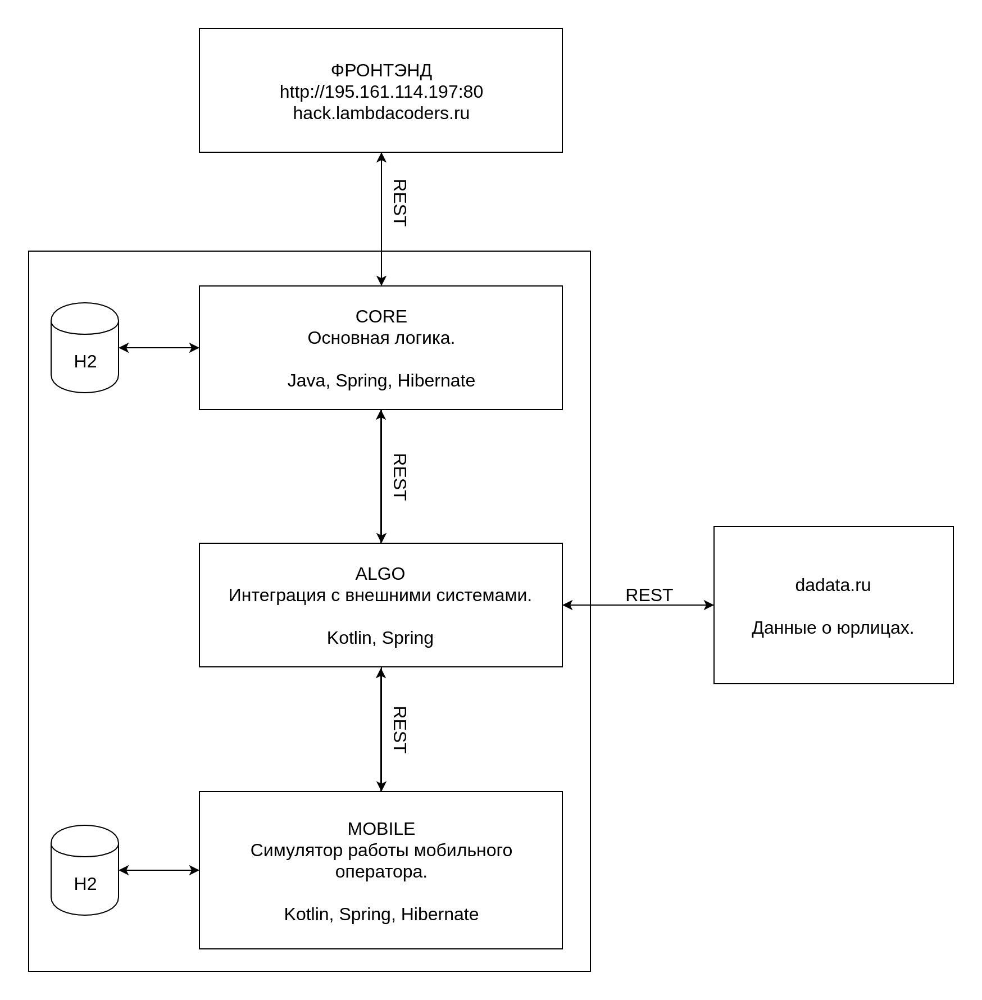

# Микросервис "Гиперион".

Бэкенд. Ядро приложения. Обработка запросов фронтэнда. Работа с интеграционным микросервисом через REST API. Расчёт наиболее подходящего отделения.

Java, Spring, Hibernate.

## Архитектура приложения

###Работа с профилями:
 ####Для запуска dev профиля в настройках запуска проекта в Program arguments указать значение: --spring.profiles.active="dev"
  
 ####По умолчанию указан профиль prod
